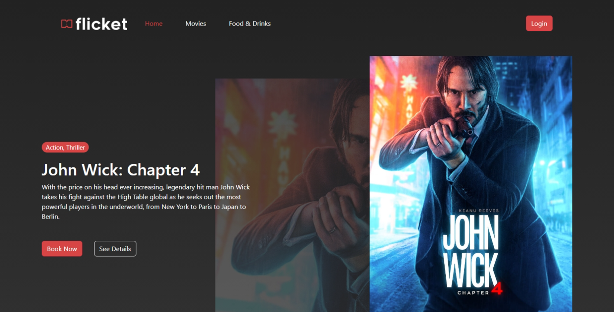
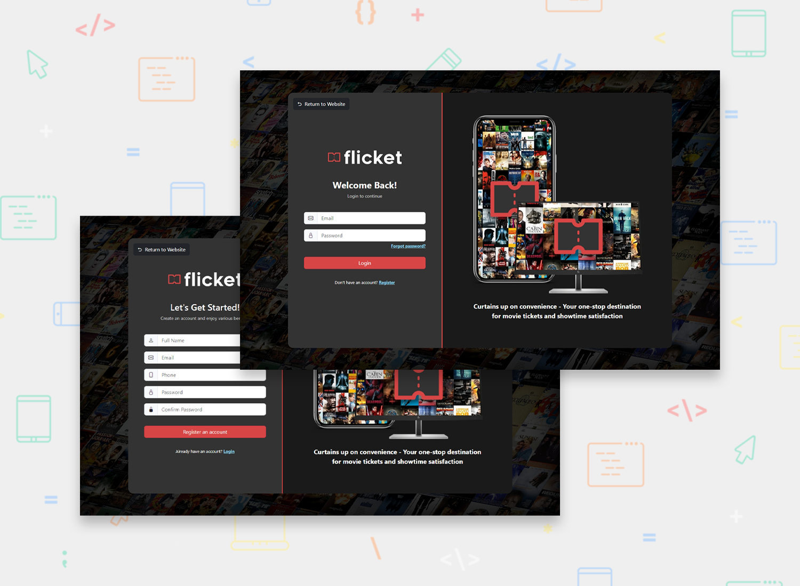
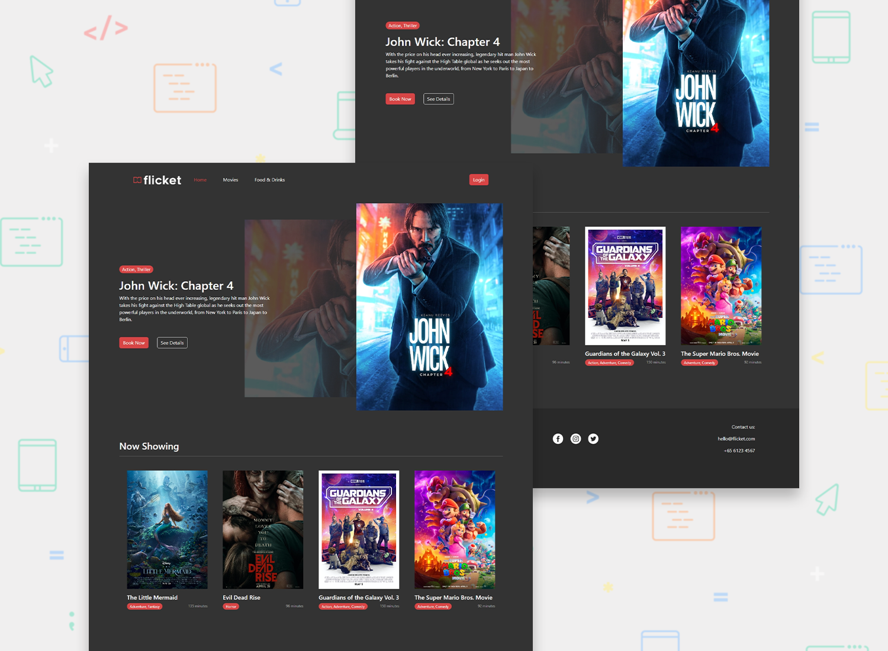
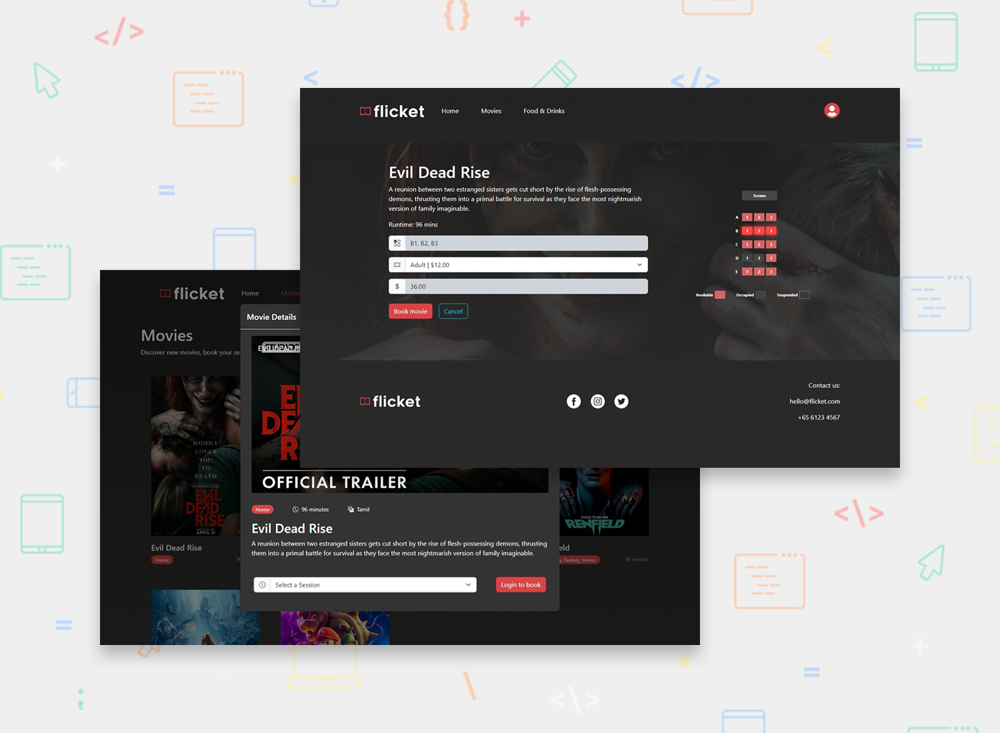
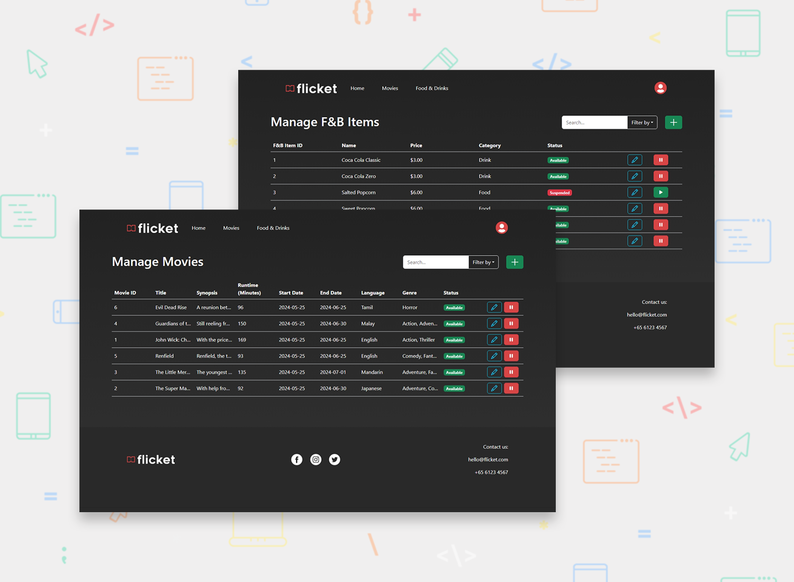
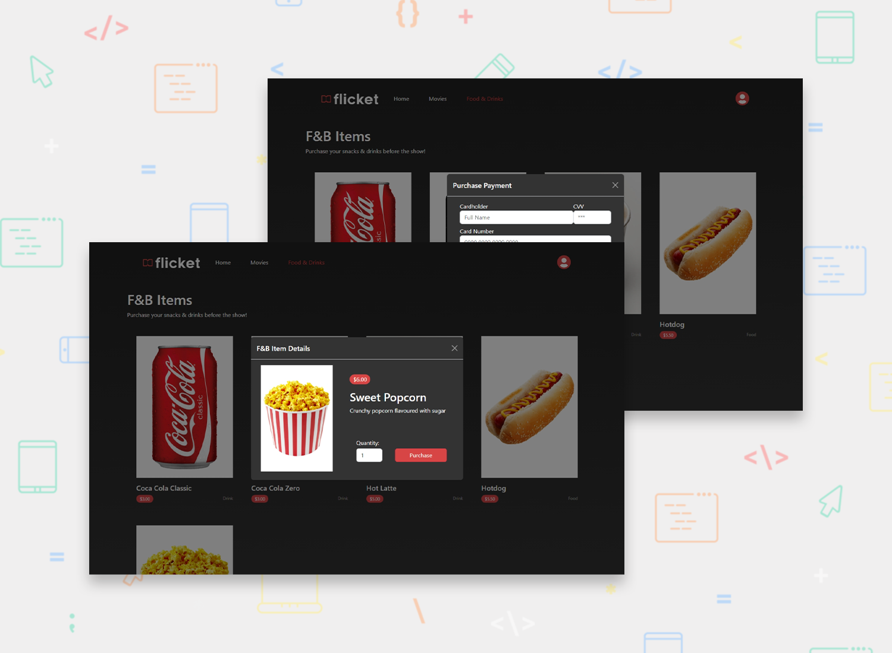

<h1 align="center">Movie Ticketing Platform (PHP + MySQL)</h1>

[Project Specifications](./Specifications.pdf)

A complete frontend and backend project for a movie ticket booking platform.

## The challenge

- Scrum practices
- CI/CD practices
- Unit Testing
- Strictly Object-oriented Programming (OOP)

 

4 user types:
- User Admin (Account management)
- Cinema Owner (Generation of sales reports)
- Manager/Staff (Manage movies, seating and F&B items)
- Customer (Purchase of tickets and F&B items)

 

<b>CRUD + Search</b> functions for the following:
- Accounts (Admin + Customer)
- Account Types (Admin)
- Sales Report Generation (Cinema Owner)
- Cinema Rooms (Manager/Staff)
- Seats (Manager/Staff)
- Movie Sessions (Manager/Staff)
- Ticket Types (Manager/Staff)
- F&B Items (Manager/Staff)
- Upcoming Bookings (Customer)

## Screenshots

## Built with

- [Bootstrap](https://getbootstrap.com/) - CSS Framework
- [XAMPP](https://www.apachefriends.org/) - PHP Development Environment
- MySQL
- Semantic HTML5 markup
- CSS custom properties

## Setting up

#### 1. Install [XAMPP](https://www.apachefriends.org/download.html)
- Tick `MySQL` and `phpMyAdmin`

#### 2. Starting localhost + MySQL Server
- Open XAMPP Control Panel
- Click `Start` for Apache and MySQL

Only have to do this once:
- Click on `Config` for MySQL and select `my.ini`
- Amend `max_allowed_packet` to `max_allowed_packet=4M` (increases file upload size)

#### 3. Running the app
- Move flicket source folder to `/xampp/htdocs` folder
- Webpage can be accessed via [localhost](http://localhost/flicket/)

#### 4. Database Access/Creation
- Go to [phpMyAdmin](http://localhost/phpmyadmin/)
- Click on `import` on the top bar
- Click `Choose File` and select the `flicketdb.sql` files in `flicket/databaseInit` folder

<b>Done</b>
